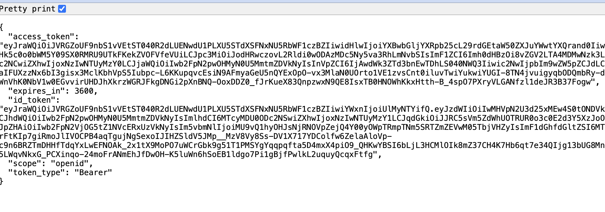

# Generating Okta OIDC Code and Exchanging for Access Token

## Overview
This guide provides details on how to create an Okta OpenID Connect (OIDC) app, run a Python Flask script to authenticate with your Okta app, retrieve an authorization code, and exchange it for an access token.


## Prerequisites
1. Okta account
2. Python 3.11 installed

## Steps

### Create an Okta OIDC App
1. Log in to your [Okta developers account](https://developer.okta.com)
2. Navigate to Applications and click on Create App Integration
3. Select OIDC - OpenID Connect and Web Application
4. Configure the application settings:
    1. Sign-in redirect URIs: http://localhost:8080/callback
    2. Sign-out redirect URIs: http://localhost:8080
5. Save the client ID, client secret, and authorization server URL

### Running the python script

The list of variables required to run this script are:
- `OKTA_OIDC_CLIENT_ID` - The client id of your OIDC application
- `OKTA_OIDC_TOKEN_URL` - The token url such `https://dev-batman.okta.com/oauth2/v1/token`
- `OKTA_OIDC_AUTHORIZATION_URL` - The authorization url such `https://dev-batman.okta.com/oauth2/v1/authorize`
- `OKTA_OIDC_AUTHORIZATION_SCOPE` - A comma separated list of valid authorization scope. If not provided, the default will be  `openid`
- `OKTA_OIDC_REDIRECT_URI` - The redirect URI. If not provided, the default will be http://localhost:8080/callback


To retrieve an authorization code, and exchange it for an access token using a Python Flask application, run the following commands: 

```bash
export OKTA_OIDC_CLIENT_ID=<ENTER CLIENT ID>
export OKTA_OIDC_TOKEN_URL=<ENTER TOKEN URL>
export OKTA_OIDC_AUTHORIZATION_URL=<ENTER AUTHENTICATION URL>
export OKTA_OIDC_AUTHORIZATION_SCOPE=<ENTER AUTHENTICATION SCOPE>
export OKTA_OIDC_REDIRECT_URI=<ENTER REDIRECT URI>

git clone https://github.com/port-labs/okta-iodc-key-exchange.git

cd okta-iodc-key-exchange

pip install -r ./requirements.txt

flask --app app run -p 8080
```

#### Okta Login and Access Token Retrieval
Navigate to http://localhost:8080/login to initiate the login process and generate the authorization code. After a successful authorization, you will be redirected to the redirect URI. On this page, you will be able to see the access token that was exchanged.



## Conclusion
By following these steps, you can successfully authenticate users with your Okta app, retrieve an authorization code, and exchange it for an access token using a Python Flask application.